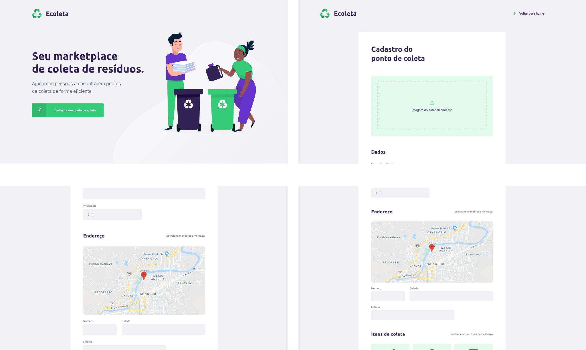

<h1 align="center">
    
</h1>

<h4 align="center"> 
	🚧 NextLevelWeek 1.0 🚀
</h4>

<p align="center">

</p>


## 💻 About the Project

♻️ **Ecoleta** - A platform to connect companies and waste collection entities with people who need to dispose of organic and inorganic waste in an eco-friendly way.

Companies or entities can register on the web platform by providing:
- An image of the collection point
- The entity's name, email, and WhatsApp number
- The address to display on the map
- One or more waste collection items:
  - Lamps
  - Batteries
  - Paper and cardboard
  - Electronic waste
  - Organic waste
  - Cooking oil

Users will have access to the mobile app, where they can:
- Navigate the map to see registered institutions
- Contact the entity via email or WhatsApp

This project was developed during the **NLW - Next Level Week**, an event by [Rocketseat](https://rocketseat.com.br).
NLW is an online experience with practical content, challenges, and hacks available for one week.


## 🎨 Layout

The application layout is available on Figma:

<a href="https://www.figma.com/file/1SxgOMojOB2zYT0Mdk28lB/Ecoleta?node-id=136%3A546">
  
</a>


### Mobile

<p align="center">
  

  
</p>

### Web

<p align="center" style="display: flex; align-items: flex-start; justify-content: center;">
  

  
</p>

## 🛠 Tecnologias

The following tools were used in building this project:

- [Expo][expo]
- [Node.js][nodejs]
- [React][reactjs]
- [React Native][rn]
- [TypeScript][typescript]


## 🚀 How to run the project

This project is divided into three parts:
1. **Back End** (server folder)
2. **Front End** (web folder)
3. **Mobile** (mobile folder)

💡 **Note**: Both the Front End and Mobile require the Back End to be running.

### Prerequisites

Before starting, ensure you have the following tools installed:
[Git](https://git-scm.com), [Node.js][nodejs]. 
- A code editor like  [VSCode][vscode]

### 🎲 Rodando o Back End (servidor)

```bash
# Clone this repository
git clone https://github.com/tgmarinho/nlw1

# Navigate to the project folder
cd nlw1

# Navigate to the server folder
cd server

# Install the dependencies
npm install

# Run the application in development mode
npm run dev:server

# The server will start at port 3333 - access http://localhost:3333
```

### 🧭 Running the web application (Front End)

```bash
# Clone this repository
git clone https://github.com/tgmarinho/nlw1

# Navigate to the project folder
cd nlw1

# Navigate to the web folder
cd web

# Install the dependencies
npm install

# Run the application in development mode
npm run start

# The application will start at port 3000 - access http://localhost:3000
```

### 📱 Running the mobile application

🚧 Under Construction… 🚧

😯 How to contribute
	1.	Fork this repository.
	2.	Create a new branch for your changes: git checkout -b my-feature
	3.	Save your changes and create a commit message: git commit -m "feature: My new feature"
	4.	Push your changes: git push origin my-feature


## 📝 License

This project is under the MIT license. See the LICENSE file for details.


[nodejs]: https://nodejs.org/
[typescript]: https://www.typescriptlang.org/
[expo]: https://expo.io/
[reactjs]: https://reactjs.org
[rn]: https://facebook.github.io/react-native/
[yarn]: https://yarnpkg.com/
[vscode]: https://code.visualstudio.com/
[vceditconfig]: https://marketplace.visualstudio.com/items?itemName=EditorConfig.EditorConfig
[license]: https://opensource.org/licenses/MIT
[vceslint]: https://marketplace.visualstudio.com/items?itemName=dbaeumer.vscode-eslint
[prettier]: https://marketplace.visualstudio.com/items?itemName=esbenp.prettier-vscode
[rs]: https://rocketseat.com.br
